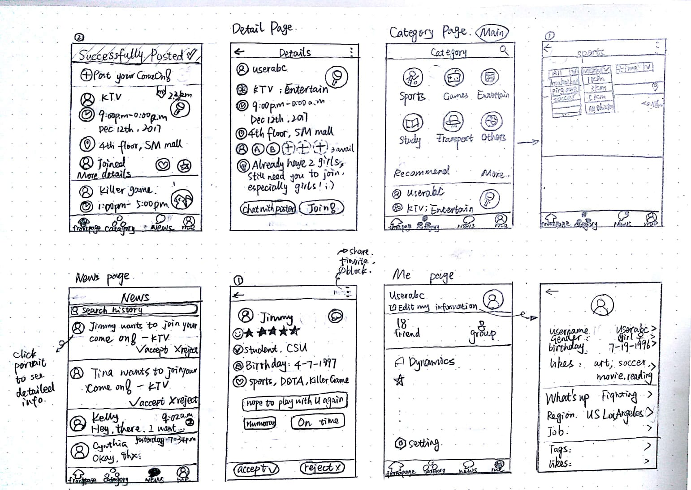

Welcome！
# General Information of Project
### Project Name
Food Wastage (Current)
### Stakeholders
1. People working in Dinning Service
2. People in need of food (eg. RIT Foodshare on FB)

# Week 3 - Milestone 1

## Problems

We are going to choose a topic from four possible ideas.

### 1. Food Wastage

We found that everyday there is a huge food wastage on campus dinning service, so we hope that we can reduce that wastage and share the extra food to people who need it.

The flow of Food Share: Producing -> Collecting -> Transport -> Distribution

The stakeholders: 1. People working in Dinning Service  2. People in need of food (eg. RIT Foodshare on FB)

The keypoint of the project: 
1. Avoid Misuse
2. Food Quality
3. Personal Verifiction ( NGO/ QR-code/ Passport/ Driver Lisence )

### 2. Usability fix for RIT mobile

We found that RIT mobile as a campus application is extremely hard to use, and we would like to improve its usability.

The problem this app has:
1. Too many functions, and some functions are useless
2. Some important functions are missing or wrong
3. The functions are hard to use due to the poor mapping, some are just linked to a website

Solution:
1. Create several categories to classify these functions in order to make a cleaner homepage
2. Add or remove some functions
3. Improve the interface of the application

### 3. Airline Transportaion

When taking a long trip, the precise information of airline is one of the most significant thing people would like to know. However, even some of the customer service of the airplane company do not know the exact information and might misguide customers.

The keypoint information:
1. Fast entrance which can apply online
2. Terminal information (eg. Transfer from different terminal)
3. Luggage weight of different flight

### 4. Event Post
1. Mainly focus on students who have need to group people in some specific events.
2. Although there also have some app to inform students like GroupOn or Facebook, the information is too many to be find precisely and on time.
3. Every post has events, time, location, joined people and details.
4. People are allowed to set all of those things, set number of people in that event, accept or reject others’ requirement.
5. Categories helped people to find events they are interested in. And in every category they can filter events by sub-category, distance and time.
6. People can rate and label others as well as block someone if they feel unhappy with them. People who have a very low rate can be warned and restricted in joining events.

## Solutions

After discussion, we agree to start to focus on Food Wastage as Plan A, and if the project doesn't go well, we will swithch to the Airline Transportaion as Plan B.

